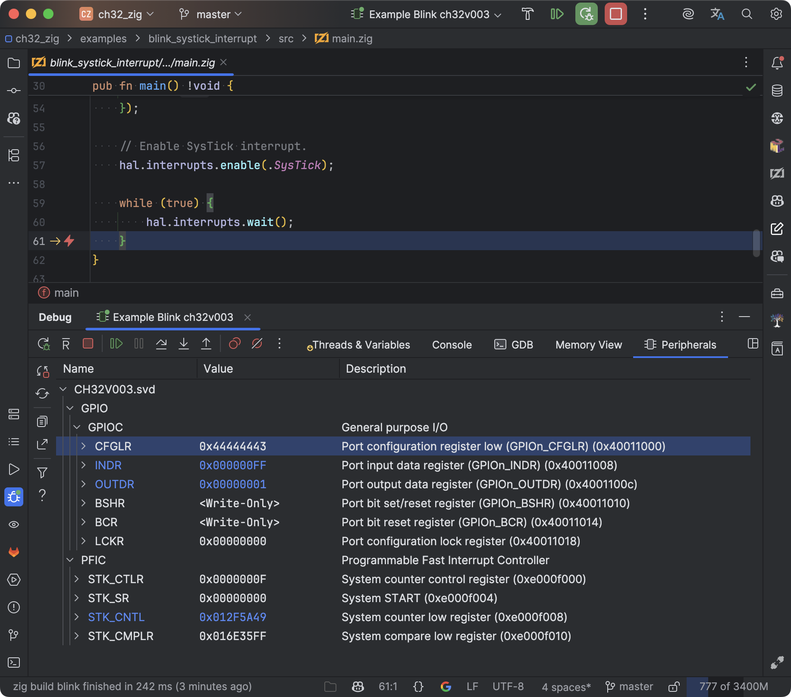
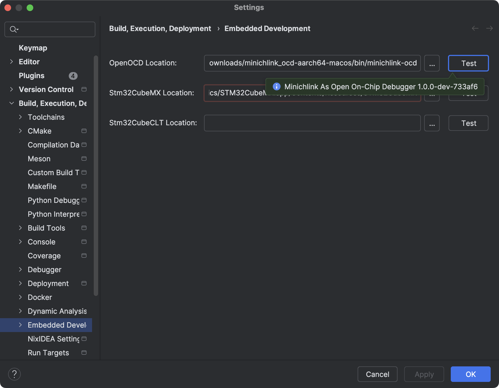
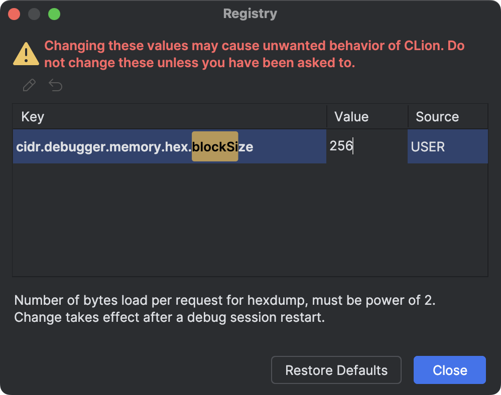

# minichlink-ocd

The official repository used as a dependency for building with the Zig compiler is located here:
https://github.com/cnlohr/ch32fun/tree/master/minichlink

## Information

This repository automatically builds and publishes binary files for `minichlink` and `minichlink-ocd`. \
You can download them at the following link: https://github.com/ghostiam/minichlink-ocd/releases/latest

## What is `minichlink-ocd`

`minichlink-ocd` is a wrapper around `minichlink` that converts commands for `openocd` into commands for `minichlink`. \
This allows to use `minichlink` in IDEs designed to work with `openocd`, such as CLion.

## Setting up CLion to work with `minichlink-ocd`

Go to `Settings | Build, Execution, Deployment | Embedded Development` and specify the path to the extracted archive
with `minichlink-ocd`. \
Click the `Test` button to check if everything works. A pop-up message with the text
`Minichlink As Open On-Chip Debugger` should appear.

### Fixing the `Memory View` feature

To make the `Memory View` feature work in CLion, you need to edit a parameter in the IDE:
[more about the issue](https://youtrack.jetbrains.com/issue/CPP-33250/clion-gdb-memory-view-issue-with-large-number-of-bytes-4096-need-gdb-cmd-logging-esp-see-the-trace-of-gdb-that-clion-uses#focus=Comments-27-7900478.0-0)

Press CTRL+SHIFT+A (CMD+SHIFT+A) -> Registry... \
Find `cidr.debugger.memory.hex.blockSize` there
(start typing `blockSize`, and the IDE will automatically filter the fields as you type),
and set the value to `256` instead of `4096`.

